# CRUD System to Manage Properties

This project is a Property Management System designed to handle the complete lifecycle 
of properties in a real estate context. It allows users to perform CRUD operations 
(Create, Read, Update, Delete) on property records, including details such as location, 
price, and description.
The system is built with a frontend for user interaction, a backend API that manages 
business logic and persistence, and a database where all property data is stored. 
Its main goal is to provide an efficient, scalable, and user-friendly solution for 
managing property information.

---

## 📦 Installation

1. Clone this repository:

   ```bash
   git clone https://github.com/LauraRo166/AREP_Architectural-Patterns.git
   cd AREP_Architectural-Patterns
   ```

2. Make sure you have Java 17+, Maven and Docker installed:

   ```bash
   java -version
   mvn -version
   docker -v
   ```
3. Build the project:

   ```bash
   mvn clean install
   ```

Should look something like this:

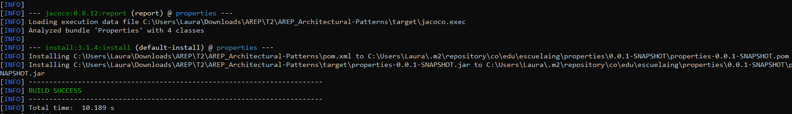

## ▶️ How to Run

Before, verify that in `application.properties` you have:

   ```
    spring.datasource.url=jdbc:mysql://localhost:3306/properties?createDatabaseIfNotExist=true
    spring.datasource.username=root
    spring.datasource.password=secret
    spring.datasource.driver-class-name=com.mysql.cj.jdbc.Driver
    spring.jpa.hibernate.ddl-auto=update
   ```
And in `Dockerfile`:

   ```
    ENV SPRING_DATASOURCE_URL jdbc:mysql://localhost:3306/properties?createDatabaseIfNotExist=true
   ```


1. Run the following command to create the database:

    ```bash
    docker run -p 3306:3306 --name mysqlproperties -e MYSQL_ROOT_PASSWORD=secret -e MYSQL_DATABASE=properties -e MYSQL_ROOT_HOST=% -d mysql:latest
    ```

2. Run the following command to run the project:

   ```bash
    mvn spring-boot:run
    ```

3. The server will listen on port 8080, you can open your browser and try the index file with:
   ```
   http://localhost:8080/
   ```

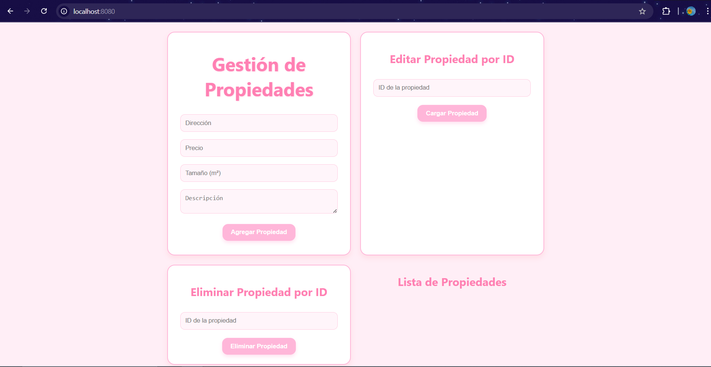
---

## 🏗️ Architecture

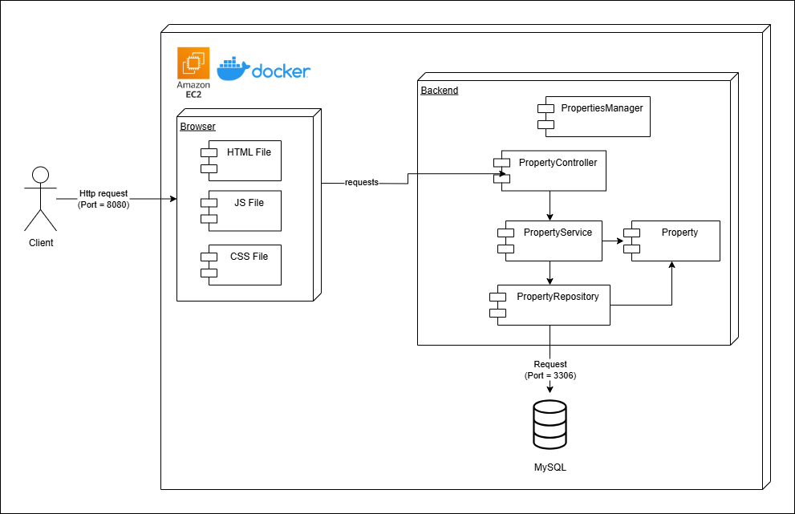

The system follows a **three-layer architecture** composed of **frontend**, **backend**, and **database**:

### Frontend (Web Application)
- Built with **HTML, CSS, and JavaScript**.
- Provides a user-friendly interface to manage properties.
- Sends requests (via **REST API calls**) to the backend for creating, viewing, updating, and deleting properties.

### Backend (Spring Boot Application)
- Implements the business logic of the system.
- Exposes **REST endpoints** (CRUD operations) to manage property data.
- Connects with the **MySQL database** using **Spring Data JPA** for persistence.
- Packaged and deployed as a **Docker container**.

### Database (MySQL)
- Stores property data in relational tables.
- Ensures persistence, data integrity, and query optimization.
- Runs as a container managed through **Docker Compose**.

### Interaction Flow
1. The **frontend** sends an HTTP request to the **backend** (e.g., to create, update, or query properties).
2. The **backend** processes the request, applies business rules, and communicates with the **MySQL database** through JPA.
3. The **database** returns the requested data to the backend.
4. The **backend** sends the response back to the **frontend**, which updates the user interface dynamically.


---
## 🧩 Class Design

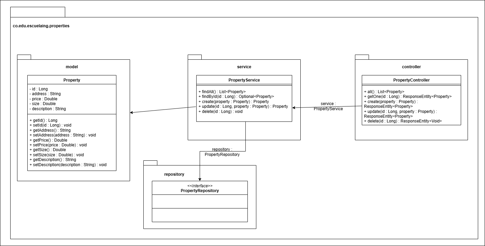

---
## ✈️ Deployment

The dockerfile is created in the root directory with the following content:

```
FROM openjdk:21

WORKDIR /usrapp/bin

ENV PORT 8080
ENV SPRING_DATASOURCE_URL jdbc:mysql://54.91.37.172:3306/properties?createDatabaseIfNotExist=true
ENV SPRING_DATASOURCE_USERNAME root
ENV SPRING_DATASOURCE_PASSWORD secret

COPY /target/classes /usrapp/bin/classes
COPY /target/dependency /usrapp/bin/dependency

CMD ["java","-cp","./classes:./dependency/*","co.edu.escuelaing.properties.PropertiesManager"]
```

and the same goes for the docker-compose.yml file:

```
version: '2'

services:

  app:
    build: .
    container_name: properties
    restart: always
    depends_on:
      - mysql
    environment:
      SPRING_DATASOURCE_URL: jdbc:mysql://54.91.37.172:3306/properties?createDatabaseIfNotExist=true
      SPRING_DATASOURCE_USERNAME: root
      SPRING_DATASOURCE_PASSWORD: secret
    ports:
      - "8080:8080"
    networks:
      - app_network

networks:
  app_network:
```

And the `application.properties` must be:
```
spring.datasource.url=${SPRING_DATASOURCE_URL}
spring.datasource.username=${SPRING_DATASOURCE_USERNAME}
spring.datasource.password=${SPRING_DATASOURCE_PASSWORD}
spring.datasource.driver-class-name=com.mysql.cj.jdbc.Driver
spring.jpa.properties.hibernate.dialect=org.hibernate.dialect.MySQL8Dialect
spring.jpa.hibernate.ddl-auto=update
spring.jpa.show-sql=true
```

We build the image, create the container and push it to the repository in `Docker hub`
```bash
docker build --tag lauraro/properties .
docker run -d -p 34000:6000 --name properties lauraro/properties
docker login
docker push lauraro/properties
```


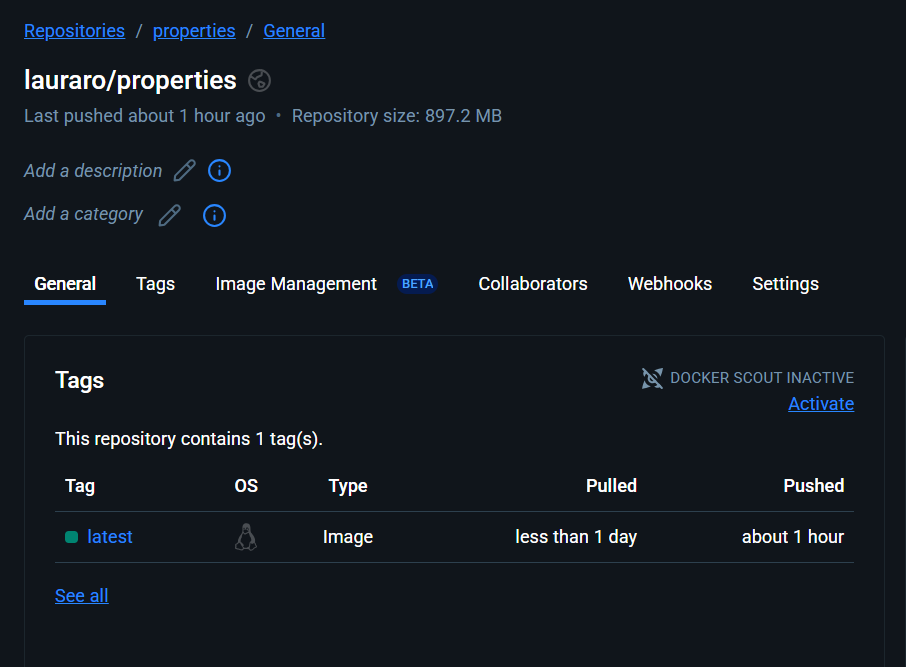


Now we create two EC2 instance in AWS, access the machines and run:
```bash
sudo yum update -y
sudo yum install docker
sudo service docker start
sudo usermod -a -G docker ec2-user
docker login
```

Reboot both instances to apply changes and execute:

1. To the machine where we will have MySQL database:
```bash
docker run -p 3306:3306 --name mysqlproperties -e MYSQL_ROOT_PASSWORD=secret -e MYSQL_DATABASE=properties -e MYSQL_ROOT_HOST=% -d mysql:latest
```
And in the security group, it enables transit through the port 3306.

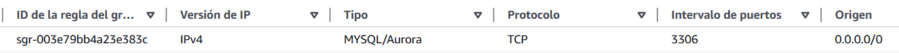

2. To the machine where we will have our application:
```bash
docker pull lauraro/properties
docker run -d -p 8080:8080 --name properties lauraro/properties:latest
```

And in the security group, it enables transit through the port 8080.

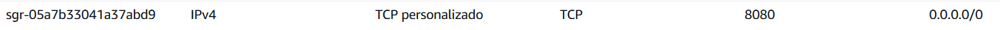

And now you can try accessing from a browser with the machine's DNS,
for example:
```
http://ec2-54-210-160-31.compute-1.amazonaws.com:8080/
```

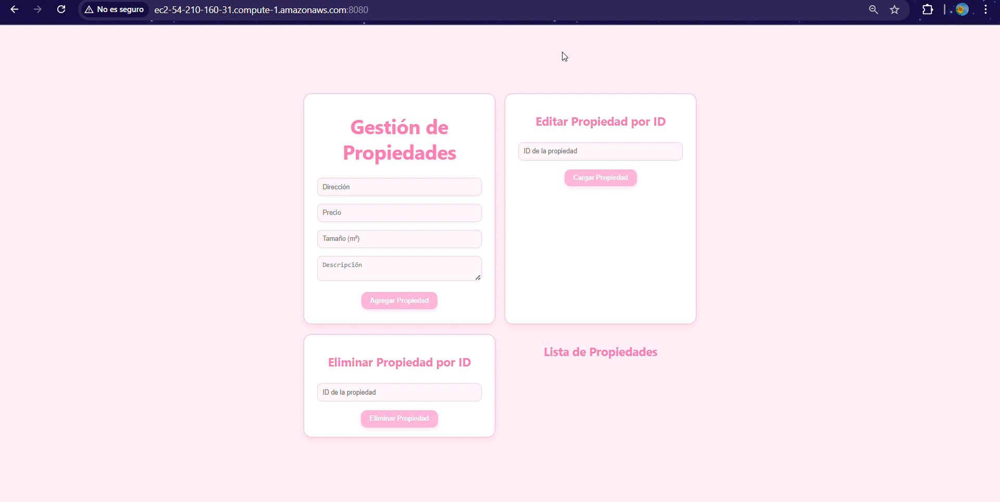

---
## ✅ Evaluation (Tests)

### Unit tests
Unit tests were created using JUnit to validate the server’s functionality:

To run the tests:

   ```bash
   mvn test
   ```

Should look something like this:

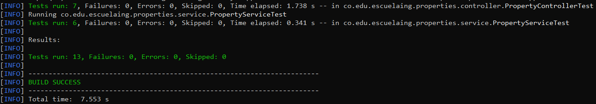

### Acceptance tests

#### Create property

First, you create a property:

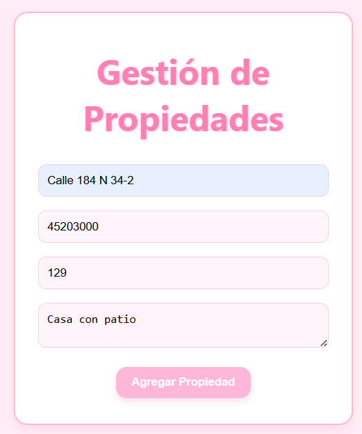

#### Get all properties

You can see it in the list below:

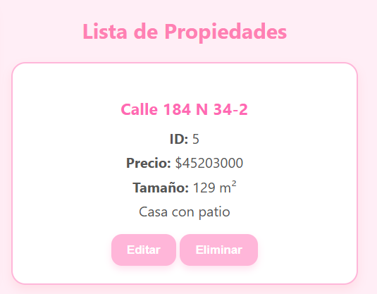

#### Get property

Or search by the ID:

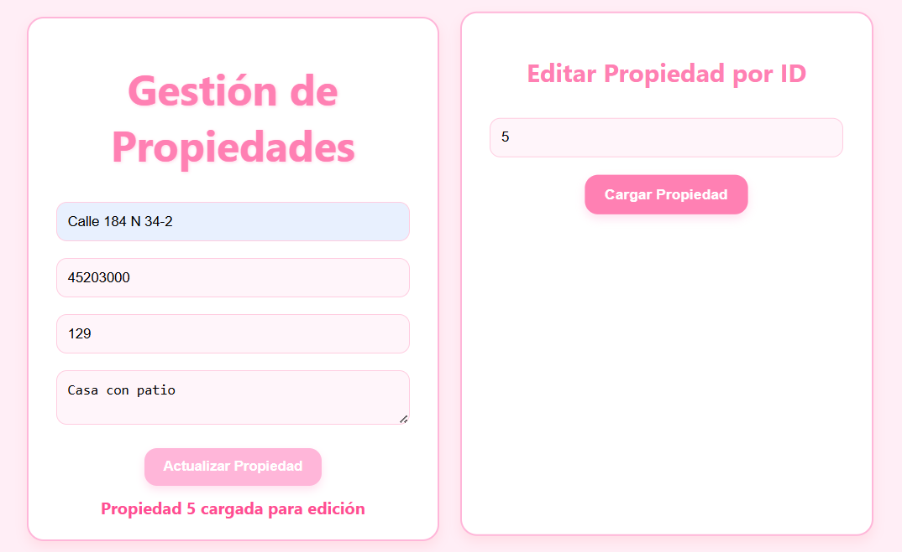


#### Update property

And now you can update by the id (like before) or select the property in the list,
modify the property, and you can see that the ID doesn´t change.

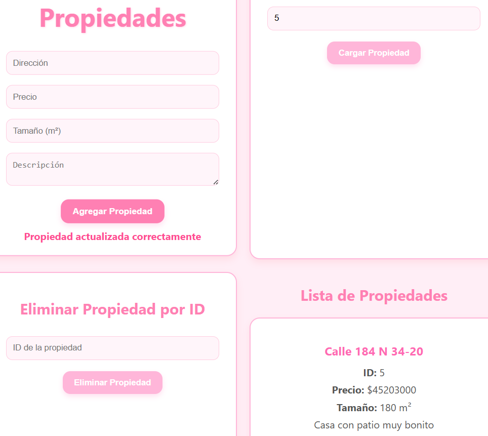
 
#### Delete property

You can delete a property with the list or by the ID:

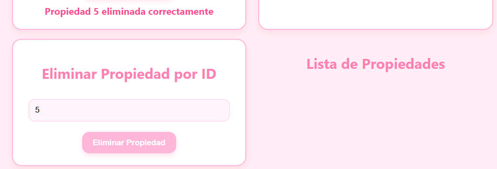

---
## 🎥 Videos

The video contains evidence of the correct operation of the Docker container deployment locally and on AWS.

**Link**: https://www.youtube.com/watch?v=sGUjsa-m3Ks

[](https://www.youtube.com/watch?v=sGUjsa-m3Ks)

---

## 👩‍💻 Author

Laura Daniela Rodríguez
